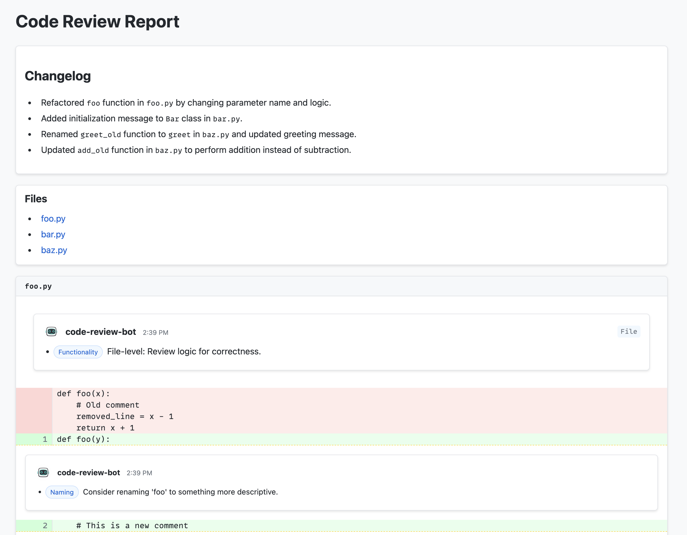

# llm-code-review

A code review application powered by RAG and small local LLMs.

## Table of Contents

- [Screenshot](#screenshot)
- [Prerequisites](#prerequisites)
- [Setting Up Your Environment](#setting-up-your-environment)
- [Executing a Code Review](#executing-a-code-review)
  - [Basic Usage](#basic-usage)
- [Configuration Options](#configuration-options)
- [Testing & Evaluation](#testing--evaluation)
- [Demo UI](#demo-ui)
- [Performance Optimization Tips](#performance-optimization-tips)
- [Additional Notes](#additional-notes)

## Screenshot



## Prerequisites

1. **Install Python 3.10+**
2. **Install [uv](https://docs.astral.sh/uv/)** using `pip install uv`
3. **Install [Ollama](https://ollama.ai)**

## Setting Up Your Environment

1. **Clone the repository**
2. **(Recommended) Create a virtual environment:**
   ```bash
   $ uv venv --python 3.12
   ```
3. **Install dependencies with uv**
   ```bash
   $ uv pip install -r requirements.lock
   ```
4. **Activate the environment**
   ```bash
   $ source .venv/bin/activate
   ```
5. **Pull required models**:
   ```bash
   $ ollama pull llama3.1
   $ ollama pull qwen2.5-coder:7b-instruct-q8_0
   $ ollama pull nomic-embed-text
   ```

## Executing a Code Review

### Basic Usage

```bash
python -m src.code_reviewer --diff patch.txt \
	 --repo /Users/kiran/Sandbox/porter/kafka-client \
	 --planner-model llama3.1:latest \
	 --worker-model  qwen2.5-coder:7b-instruct-q8_0 \
	 --embedding-model nomic-embed-text:latest \
	 --format comprehensive_html
```

To generate a patch file, use the following commands:

```bash
# For all changes in staging area
git diff > patch.txt

# For changes between branches
git diff main feature-branch > patch.txt

# For changes in specific files
git diff -- path/to/file1.py path/to/file2.py > patch.txt
```

## Configuration Options

| Option             | Description                                | Default                             |
|--------------------|--------------------------------------------|-------------------------------------|
| `--diff`           | Path to git diff file                      | *Required*                          |
| `--repo`           | Path to repository root                    | `./` (current directory)            |
| `--prompt`         | System prompt for the code review          | "Perform a thorough code review..." |
| `--ollama-host`    | Host of the Ollama API                     | http://localhost:11434              |
| `--planner-model`  | Model for planning and summarization       | llama3.1                              |
| `--worker-model`   | Model for worker agents                    | qwen2.5-coder:7b-instruct-q8_0                           |
| `--embedding-model`| Model for text embeddings                  | nomic-embed-text                    |
| `--reindex`        | Force reindexing of the codebase           | false                               |

## Testing & Evaluation

To run all tests:

```bash
$ pytest
```

To run evaluations, do the following:

```bash
# Install project as a package to enable running the evaluation script
$ pip install -e .

# Evaluate context (file + symbol) retrieval
$ python -m code_reviewer.evals.code_retrieval_eval --test-cases-file src/code_reviewer/evals/test_cases.json

# Evaluate symbol retrieval
$ python -m code_reviewer.evals.code_retrieval_eval --test-cases-file src/code_reviewer/evals/test_cases_symbol_lookup.json
```

## Additional Notes

- The `.chroma` directory stores the code index and can be deleted to force a full reindex.